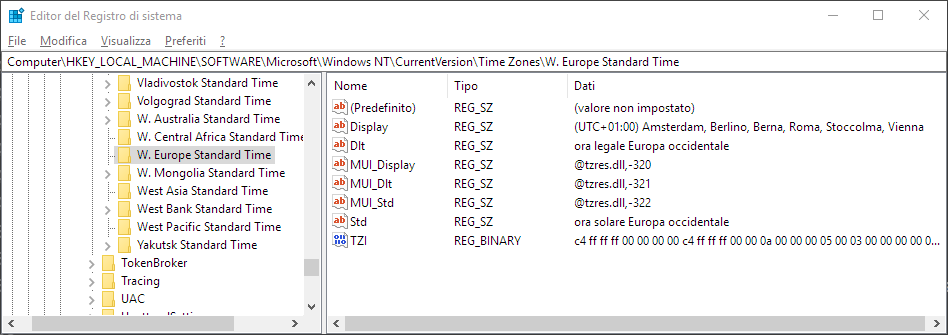

# Risoluzione problema con *time zone*

## Premessa

Il problema descritto si manifesta solamente con la combinazione dei seguenti fattori:
1. sistema operativo Windows (verificato su Windows 10)
1. sistema operativo installato in lingua italiana (o quantomeno non in lingua inglese)
1. JDBC driver di MySql-Oracle (`Connector/J`) versione 8.* (non versione 5.*)

Quindi non si manifesta con computer di tipo Mac, né con Windows in inglese, né utilizzando versioni "vecchie" del `Connector/J`.

## Descrizione del problema

### Sintomo

Il problema si manifesta nel momento in cui si cerca di aprire una connessione al database:
```java
String jdbcURL = "jdbc:mysql://localhost/dizionario?user=root&password=root" ;
Connection conn = DriverManager.getConnection(jdbcURL) ;
```
viene generata l'eccezione
```
java.sql.SQLException: The server time zone value 'ora solare Europa occidentale' is unrecognized or represents more than one time zone. You must configure either the server or JDBC driver (via the serverTimezone configuration property) to use a more specifc time zone value if you want to utilize time zone support.
```
e la connessione non viene creata.

### Cause

La causa del problema è dovuta alla combinazione di tre fattori diversi:
1. una diversa gestione dei fusi orari nella versione 8 di `Connector/J` (che cerca di gestire correttamente i fusi orari, mentre la versione 5 spesso non implementava bene le correzioni di orario)
1. il fatto che MySql non abbia definita un "proprio" fuso orario, ma riporti quello di sistema
1. il fatto che Windows in italiano abbia tradotto anche i nomi dei fusi orari.

Il risultato è che quando il driver JDBC chiede a MySql in quale fuso orario sta girando, questi gli risponde `ora solare Europa occidentale`, e tale stringa non è riconosciuta da Java.

Solitamente, infatti, MySql non definisce un proprio fuso orario, ma utilizza quello del sistema operativo:
```sql
SELECT @@global.time_zone, @@session.time_zone;
```
restituisce
| `@@global.time_zone` | `@@session.time_zone` | 
| -------------------| --------------------|
| `SYSTEM`             | `SYSTEM`              |

Quindi MySql interroga il sistema operativo, il quale risponde:
```sql
select @@system_time_zone;
```
| `@@system_time_zone` | 
| -------------------| 
| `ora solare Europa occidentale` |
e questa informazione non è comprensibile alla libreria Java (che riconosce i fusi orari elencati nell'array restituito da `TimeZone.getAvailableIDs()`).

Il fatto che sia colpa di Windows si vede consultando il registro di sistema alla voce `Computer\HKEY_LOCAL_MACHINE\SOFTWARE\Microsoft\Windows NT\CurrentVersion\Time Zones\W. Europe Standard Time`, dove compaiono appunto delle stringhe tradotte in italiano.




## Soluzioni possibili

### Modificare la stringa di connessione

Si può dire al driver JDBC di non utilizzare l'informazione fornita da MySql, ma di *forzare* un determinato fuso orario. È sufficiente aggiungere al termine della stringa di connessione `jdbcURL` il seguente parametro:
```
serverTimezone=UTC
```
o anche
```
serverTimezone=Europe/Rome
```

Ad esempio:
```java
String jdbcURL = "jdbc:mysql://localhost/dizionario?user=root&password=root&serverTimezone=Europe/Rome" ;
```

### Utilizzare `Connector/J` versione 5

Utilizzando versioni precedenti del Connector/J il problema non si presenta. Ovviamente non è una soluzione consigliata a lungo termine, ma nell'immediato potrebbe essere utile. Ad esempio è stato verificato che con la versione 5.1.47 il problema non si verifica.

### Impostare un fuso orario esplicito in MySql

Questo si può fare andando a modificare il file di configurazione `my.cnf` o `my.ini`. Vedi https://stackoverflow.com/a/19069310/986709


## Fonti

* Segnalazione bug [MySQLD On Localized Windows OS doesn't work with Connector J 8.x.x](https://bugs.mysql.com/bug.php?id=93091)
* https://stackoverflow.com/questions/7605953/how-to-change-mysql-timezone-in-a-database-connection-using-java
* https://stackoverflow.com/questions/930900/how-do-i-set-the-time-zone-of-mysql
* https://insidemysql.com/connector-j-8-0-11-the-face-for-your-brand-new-document-oriented-database/
* https://dev.mysql.com/doc/connector-j/8.0/en/connector-j-usagenotes-known-issues-limitations.html
* https://mariadb.com/kb/en/library/configuring-mariadb-with-option-files/
* https://stackoverflow.com/a/19069310/986709
* https://stackoverflow.com/questions/19023978/should-mysql-have-its-timezone-set-to-utc/19075291#19075291
