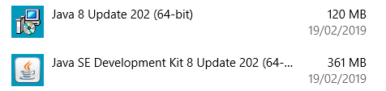
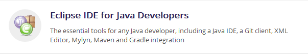
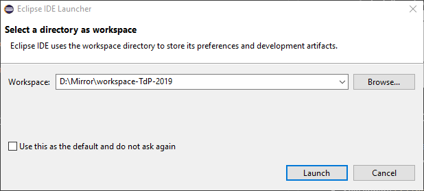

# Installazione Software per Tecniche di Programmazione

## Installazione Java JDK

* Scaricare `Oracle Java 8 JDK`: 
    * https://www.oracle.com/technetwork/java/javase/downloads/index.html
    * Selezionare `JDK`/Download nel box `Java SE 8u201 / Java SE 8u202`
    * Arrivare alla pagina [Java SE Development Kit 8 Downloads](https://www.oracle.com/technetwork/java/javase/downloads/jdk8-downloads-2133151.html)
    * Andare al box `Java SE Development Kit 8u202`
    * Accept License Agreement -> `jdk-8u202-windows-x64.exe`
    * Installare il pacchetto scaricato
    * 

## Installazione Eclipse

* https://www.eclipse.org/downloads/
* Download 64 bit -> Download -> scarica `eclipse-inst-win64.exe`
* Eseguire `eclipse-inst-win64.exe`
* Selezionare `Eclipse IDE for Java Developers` 
* Procedere con l'installazione

## Avvio di Eclipse

* Avviare Eclipse
* Selezionare una cartella in cui salvare il Workspace 
* Verificare ed installare eventuali aggiornamenti (Help | Check for Updates)

## Installazione plugin e(fx)clipse

* Si tratta di un plugin interno ad Eclipse che facilita lo sviluppo di applicazioni JavaFX
* `Help` | `Eclipse Marketplace`
* Nella casella `Search` scrivere `javafx` e selezionare `e(fx)clipse 3.4.1` 

## Installazione Scene Builder

* Si tratta di un editor grafico per la creazione di interfacce JavaFX
* Scaricare dal sito di Gluon il programma [Scene Builder](https://gluonhq.com/products/scene-builder/)
* Selezionare `Download Scene Builder for Java 8` (versione `8.5.0`, Windows Installer 64-bit)

## Configurazione di Scene Builder in Eclipse

* Avviare Eclipse
* Selezionare `Window`/`Preferences`
* Dall'elenco di sinistra, selezionare `JavaFX`
* Nella casella `SceneBuilder executable` selezionare la posizione in cui è stato installato Scene Builder.
    * **Attenzione**: non indicare la posizione dell'installer, ma la posizione in cui è stato salvato il programma vero e proprio. Tale posizione solitamente è in una cartella *nascosta*, che si può raggiungere digitando `%appdata%` in una finestra di Explorer. Solitamente si trova in una cartella simile a `C:\Users\Fulvio\AppData\Local\SceneBuilder`. Una volta trovata la cartella, selezionare `SceneBuilder.exe`
* Dopo questa impostazione, sarà possibile aprire Scene Builder direttamente da Eclipse, dal menù contestuale (right-click) su un file `FXML`

## Installare un server di database

### Opzione 1: MariaDB

* Scaricare il server dal sito di [MariaDB](https://mariadb.org/)
* Dalla pagina di [Downloads](https://downloads.mariadb.org/) selezionare `Download 10.3.13 Stable Now!`
* Scaricare il `MSI Package` per Windows (`mariadb-10.3.13-winx64.msi`)
* Eseguire l'installer
* Durante l'installazione, scegliere una password per l'utente `root` (e non dimenticarla!)

### Opzione 2: MySQL

### Opzione 3: XAMPP

## Installare un'interfaccia di gestione del database

### Opzione 1 (per Windows): HeidiSQL

* Visitare il sito di [HeidiSQL](https://www.heidisql.com/)
* Dalla pagina `Downloads`, selezionare `Installer, 32/64 bit combined`
* Scaricare ed installare il programma

### Opzione 1 (per Mac): SequelPro

* Visitare il sito di [SequelPro](https://www.sequelpro.com/)
* Selezionare 'Download'
* Scaricare ed installare il programma

### Opzione 2: MySQL Workbench

### Opzione 3: PhpMyAdmin

## Installare il Driver JDBC per MySQL/MariaDB

Nota: le due opzioni seguenti sono alternative equivalenti. Per essere chiari: il MySQL Connector/J funziona sia con MySQL che con MariaDB; il MariaDB Connector/J funziona sia con MySQL che con MariaDB.

### Opzione 1: MySQL Connector/J di Oracle

* Scaricare il pacchetto `Connector/J` dal sito [dev.mysql.com](https://dev.mysql.com/downloads/connector/j/)
* È possibile selezionare la voce `Platform Independent` per scaricare il pacchetto *Platform Independent (Architecture Independent), ZIP Archive*, che contiene il file `mysql-connector-java-8.0.15.zip`
* Scompattare il file zip in una cartella a scelta, in particolare sarà necessario il file `mysql-connector-java-8.0.15.jar`

### Opzione 2: MariaDB Connector/J di MariaDB

- Visitare  [https://mariadb.com/kb/en/library/about-mariadb-connector-j/](https://mariadb.com/kb/en/library/about-mariadb-connector-j/)
- Selezionare "Download MariaDB Connector/J"
- Nella pagina successiva selezionare "Java 8 connector" e poi Download
- Si ottiene il file `mariadb-java-client-2.4.1.jar` che è proprio la libreria che contiene il Driver JDBC voluto.
